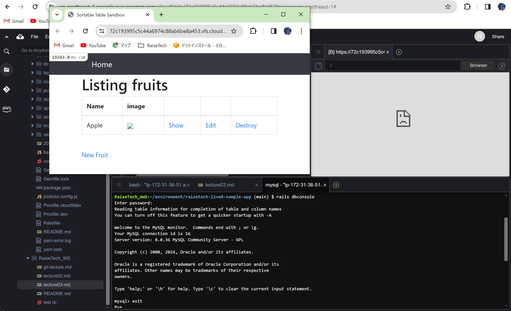

# 課題3

###  APサーバーについて調べる

---

* APサーバーの確認

```
$ rails s
```


APサーバーは、pumaでした。

<br>
<br>

* バージョンを確認

```
$ puma
```


pumaのバージョンは5.6.8

<br>
<br>

* puma(APサーバー)を停止するとアプリが起動しなくなり、再起動させるとアプリが動作することを確認。


<br>
<br>

---


### BDサーバーについて調べる

---

* DBサーバーの確認

```
$ rails dbconsole
```


DBサーバーは、MySQLで、バージョンは8.0.36でした。

<br>
<br>

* MySQL(DBサーバー)を停止すると、エラーが出て処理がうまくいかない様子。

```
$ sudo service mysqld stop
```


<br>
<br>

* MySQL(DBサーバー)を再起動させると、アプリが正常に動作しました。

```
$ sudo service mysqld restart
```


<br>
<br>

* Gemfileを確認すると、構成管理ツールはBundlerが使用され、様々なGemファイルが管理されていました。


