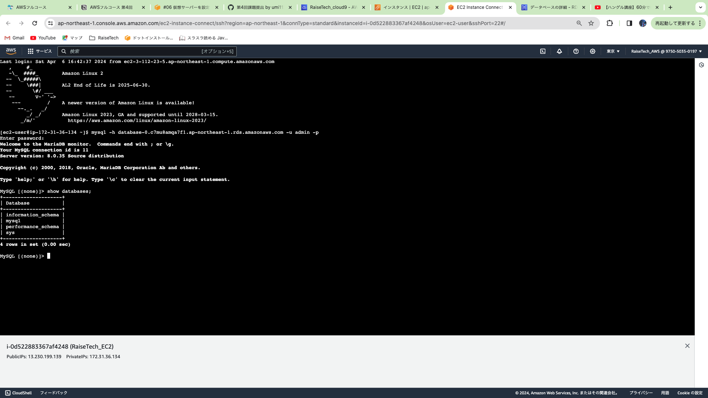

# 課題４

* EC2の構築と起動の確認

   　
   
   
<br>

* RDSの構築

   
<br>

* EC2からRDSへの接続確認

   
<br>

* VPCの作成

   
<br>

* セキュリティーグループ設定情報

   
<br>

* サブネット(詳細)

    
  
   

   
<br>

* ルートテーブル　→追加

    
<br>

* EC2セキュリティーグループ

   
<br>

* RDSセキュリティーグループ

   
<br>

* MySQLへの接続　→修正

   
<br>

---

<br>

#####　気づいたことメモ
1. 作業用ディレクトリの確認を忘れないこと<br>
 →　logや作業ディレクトリが見つからない。消失したと騒ぐことになる。

1. MySQLへのアクセスの際、ssh接続を忘れないこと<br>
 → インストーラーやアップデートがうまくいかない理由？

1. SSh接続の際のキーの場所<br>
 →　コマンドを叩いてもディレクトリやファイルが見つかりませんと返される

1. MySQLのインストールにはyumとdnfとがあり、updateをしてからinstallのコマンドを叩くこと<br>
 → Linux２はyum、Linux 2023はdnfコマンドのよう。じゃないとうまく動作しなかった

1. GPGキーの有効期限<br>
 → インストールする際、改竄防止のGPG Keyが存在しないと言うエラーが出てしまう。
 
  ```
  rpm --import https://repo.mysql.com/RPM-GPG-KEY-mysql-2023
  ```
  を実行してキーを更新して再度インストールの実行で解決。

---

MySQL関連で苦戦したが、障害の切り分けには自分が今どの位置にいて、実行したいことは何か??<br>
その前手順と本手順の確認。どこまで実行できているのか、依存関係（バージョンや期限）の確認<br>
とても些細なことかもしれないが、何か一つが欠けていると実行できずERRになるので状況確認が大切<br>
であると身に染みました。PCのOSに問題があるのかと思い、WindowやMacの両方で試してみたりしたが、<br>
クラウド上で動作させているのだから、ローカルのOSは関係ないのでは？？と思い至り別の視点から検索<br>
情報発信の日時を確認し最新情報なのかに注目。返答された内容を読み解けたことも成功の鍵だった。<br>
